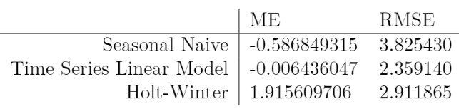

# Time Series Analysis of Minimum Temperatures in Melbourne, Australia

### Project Scope
In this data, we have daily readings of minimum temperatures from Melbourne, Australia for 10 years (1981-1990). I was curious to see if any global warming trends would be visible on the 10-year scale. The reason for choosing minimum temperatures might not seem obvious, but I decided to play with those in order to observe extreme case of global warming. If minimum temperatures directly indicate presence of glabal warming, then we may need to do something before it is too late. I was also curious to see which of the models commonly used in time series forecasting would perform the best. The source code can be viewed in 3 formats: *.ipynb*, *.PDF*, and *.HTML*.

### Models Used
-Seasonal Naive  
-Time Series Model with Seasonality  
-Holt-Winter  

### Key Exploratory Figure

### Conclusions
Even though we learned a lot about the models, it wasn’t possible to conclude anything globalwarming tendencies. There are 2 possible reasons for this: 1). The range of data is not large enough. It might be more reasonable to obtain at least 50 years of minimum temperature readings and take a look at the data trend to make more appropriate conclusions; 2). While only Melbourne, Austria, was considered in the this analysis, it might be more effective to consider at lear 3 various locations to draw out a better conclusion.
